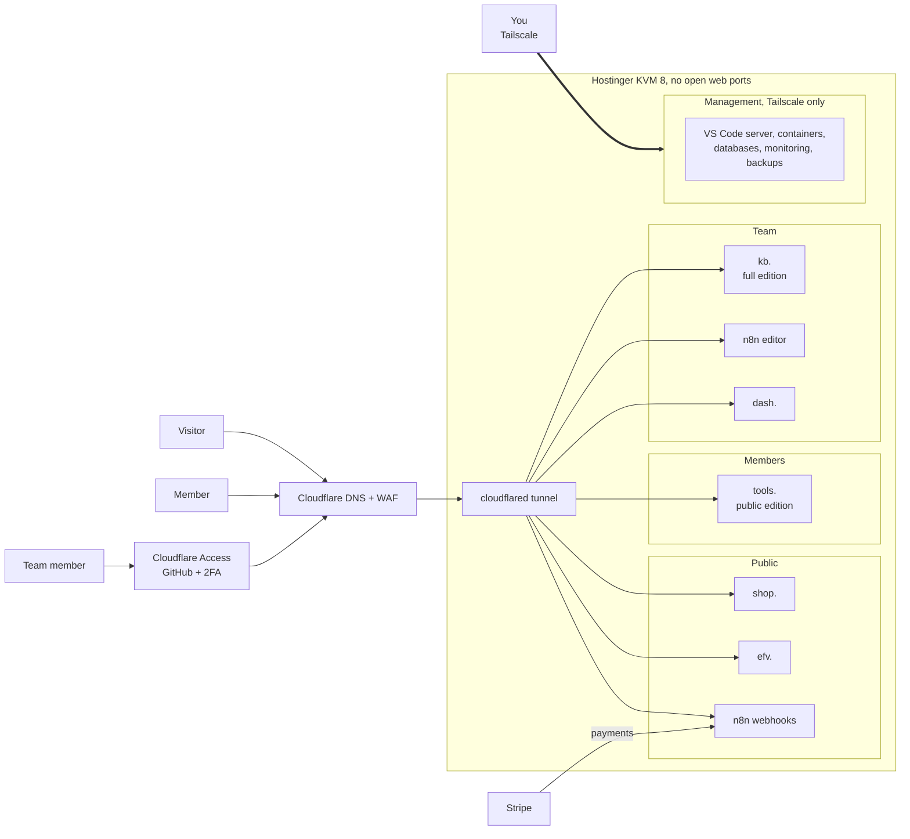

# techtheworld.win on one server: plan

**Goal:** one Hostinger **KVM 8** VPS (8 vCPU, 32 GB RAM, 400 GB NVMe, 32 TB bandwidth) runs every site and service on **techtheworld.win**, as a small, private mock enterprise network. If you've already bought a KVM 4, build on it first: Hostinger upgrades in place, and the upgrade is due before the shops and the learning platform open (see *Server size*).

It runs:

- public websites;
- a paywalled, invite-only members area;
- a team-only intranet;
- an admin-only management network;
- a family of ventures that start in beta with low traffic and grow: shops, a consignment marketplace, live shopping, private communities, and an archive and learning platform.

The domain stays on Cloudflare, and the server has **no open web ports**.

This replaces the hosting parts of `LIVE-SITE-PLAN.md` (Wix, shared hosting), which stays in `efv-kb` at `deploy/LIVE-SITE-PLAN.md`. The Library parts of that plan still apply:
- Admin and User accounts and the admin portal;
- auto-save, Ctrl+S and Save project;
- the scanned project folder layout;
- the Chrome web app;
- Admin editing.

**How to build it, step by step:** [`RUNBOOK.md`](RUNBOOK.md).

**The business side:** what each venture sells, to whom, and in what order is in [`VENTURES-PLAN.md`](VENTURES-PLAN.md), across the four areas: EFV, A La Mode, Ogun Tech Solutions and the AP Project.

Status: plan only. Nothing here is built yet. See *Still to confirm* at the end.

---

## What runs on it

| # | Service | Address (proposed) | Who gets in |
|---|---|---|---|
| 1 | **EFV Library, full edition** (internal documents, every app and template) | `kb.techtheworld.win` | Your team: up to 5 people, you as Admin, the rest Users |
| 2 | **EFV Library, public edition** (the apps and templates only, no internal documents) | `tools.techtheworld.win` | Invited members with an active paid subscription |
| 3 | **Ogun Tech Solutions store**: a tech shop, plus EFV merch (an Odoo website) | `shop.techtheworld.win` (can move to an Ogun Tech domain later) | Anyone |
| 4 | **EFV website** (dynamic, early beta, low traffic) | `efv.techtheworld.win` | Anyone |
| 5 | **n8n** (automation) | `n8n.techtheworld.win` | You (editor); its webhook addresses are public so Stripe and others can call them |
| 6 | **IT pro dev dashboard** | `dash.techtheworld.win` | You, plus guests you allow, read-only (see *The dashboard: public but private*) |
| 7 | **Status page** | `status.techtheworld.win` | Your team |
| 8 | **Management tools** (VS Code server, containers, databases, monitoring) | Tailscale only, no public address | You |
| 9 | **Odoo** (Community edition): the back office and engine for every shop and the learning platform | `erp.techtheworld.win` | Your team (see *Odoo*) |
| 10 | **Clothing shop**: new, used and custom clothes (an Odoo website). **On hold:** it was planned as A La Mode's shop, and A La Mode no longer sells (see *Still to confirm*) | `wear.techtheworld.win` | Anyone |
| 11 | **Specialty marketplace**: niche new and used items that sellers submit; the shop handles pickup and payment (an Odoo website) | `finds.techtheworld.win` | Anyone; sellers submit items through a form |
| 12 | **Live and hybrid shops**: live selling streams, plus pop-up and in-person sales on the same stock | `live.techtheworld.win` | Anyone |
| 13 | **Archive and learning platform**: videos, documents and courses, a mix of YouTube, Scribd and Udemy | `learn.techtheworld.win` | Anyone for free content; members for paid courses |
| 14 | **Private Discord communities**: run on Discord; a bot on the server gives members the right roles | Discord invite links | Members and the people you invite |
| 15 | **EFV Sound**: streaming, physical sales and artist releases (see *The realms*) | `sound.techtheworld.win` | Anyone; subscribers for full-length hi-res streams |
| 16 | **EFV Games**: browser games, demo downloads, mods and community | `games.techtheworld.win` | Anyone |
| 17 | **EFV Film**: the project showcase | `film.techtheworld.win` | Anyone; pitch decks on request |
| 18 | **A La Mode showcase**: a 3D flagship hall to walk through, with a classic store view, A La Mode's collections and an atelier customiser (2D and 3D), built from `aLaMode-kb`. Nothing can be bought; requests go to the atelier by contact | `alamode.techtheworld.win` | Anyone |
| — | **Landing page**: the interactive solar system | `techtheworld.win` and `www.` | Anyone |

### The landing page: a living solar system

`techtheworld.win` is a one-page, interactive 3D universe (WebGL, three.js). The destinations aren't buttons; they're worlds in the sky:

| World | Is | Does |
|---|---|---|
| **The sun** (procedural, animated surface) | The core | Gives the clues, one per touch |
| Ocean planet with clouds | **EFV** | Opens `efv.` |
| Red desert planet | **TOOLS** | Opens `tools.` |
| Ringed gas giant | **SHOP** | Opens `shop.` (Ogun Tech Solutions) |
| Ice planet | **DASH** | Opens `dash.` |
| Rose and violet banded giant | **A LA MODE** | Opens `alamode.` (the fashion showcase) |
| Teal and ochre world with a swarm of tiny moons | **FINDS** | Opens `finds.` (specialty marketplace) |
| Dark world lit by city lights, with a pulsing red *live* beacon | **LIVE** | Opens `live.` (live and pop-up shops) |
| Huge ringed blue giant on the outer edge | **LEARN** | Opens `learn.` (archive and courses) |
| Gold-and-black world with grooves like a record, and rings | **SOUND** | Travels to the EFV Sound realm |
| Blocky green world made of pixels, with magenta "coins" | **GAMES** | Travels to the EFV Games realm |
| Amber world wrapped in a strip of film, with two moons | **FILM** | Travels to the EFV Film realm |
| Twin worlds circling each other | **GUILD** | The private Discord communities; invitation only |
| Pulsar with sweeping beams | SIGNAL | Puzzle step 1 |
| Small moon of the ice planet | ECHO | Puzzle step 2 |
| Comet with a tail that streams away from the sun | KEY | Puzzle step 3 |
| Lava world, asteroid belt, distant nebula | EMBER, DRIFT, NOISE | Decoys with their own effects |
| Rogue planet with a cyan aurora, hidden until the puzzle is solved | **KB** | Opens the team sign-in for `kb.` |

- **Adding a world:** each world is one entry in a list in the page (name, size, orbit, surface type, address). A new venture means a new entry, and a new world appears in the sky.
- **The sky:** about 25,000 stars with real colour temperatures that twinkle, a Milky Way band and faint nebulae. Every planet surface is generated in the browser, so there are no image files to download.
- **A live clock:** every world's position comes from the visitor's local time. EMBER is the second hand, EFV the minute hand and TOOLS the hour hand, with a dial of Roman numerals on the rim. The outer worlds turn once per day, week, month, moon phase, season, year and longer. The visitor's date and time show in the top left.
- **The zodiac:** the twelve zodiac constellations ring the far sky from real star positions, each joined by faint gold lines, with a violet ecliptic ring threading through all twelve. The ring turns with the date, so the constellation the Sun is in today sits at XII, and the top left shows it ("Sun in Virgo").
- **The look:** EFV Noir, the base theme for every EFV web interface (`efv-kb/brand/efv-noir/`), with EFV Warlord for the logo and titles.
- **Moving around:** drag to look around, scroll or pinch to zoom. Touch a world to fly to it; touch empty space or *Overview* to fly back. When left alone, the view drifts slowly round the system.
- **The cipher:** the message at the top decodes as you go. Following the sun's clues (signal, echo, key) draws light between the worlds and brings the hidden archive planet into view. As before, it's decoration: `kb.` still requires GitHub sign-in.
- **For everyone:** every world can be reached with Tab and Enter, with a label shown on the world itself. There's a plain *List view* of every link, sound stays off until switched on, and motion stops for people who turn off animation. Browsers without WebGL get the list automatically.
- **Light on the server:** it's a static page; the 3D work happens on the visitor's device.
- **Prototypes:** in `efv-kb`, which owns the landing page and the realms: `deploy/landing/index.html` (the universe), `sound.html`, `games.html` and `film.html` (the realms), and `deploy/landing/hive-v1.html` (the earlier flat hive). Open `index.html` in Chrome to try the whole trip.

### The realms: EFV Sound, Games and Film

EFV's three creative arms are realms, not links. Each has its own planet, its own site and its own look, and the trip between them is part of the experience:

- **Going in:** touch the planet, then *Travel*. The camera dives at the planet, the view stretches, and the screen floods with the realm's colour before the realm opens.
- **Each realm's intro:** Sound starts with a waveform that breaks into rings and resolves into *EFV SOUND*. Games powers on like an old CRT and asks you to *INSERT COIN*. Film runs a film-leader countdown (3, 2, 1) into a title card.
- **Coming back:** every realm has *Return to orbit*, with its own exit (the waveform fades, the tube switches off, the iris closes). The universe opens at that realm's planet, says *Back in orbit from EFV Sound*, and pulls back to the whole system.

| Realm | Feels like | In the prototype |
|---|---|---|
| **EFV Sound** `sound.` | A listening room: TIDAL's features, plus physical copies and artist services | Home, Explore, album pages, a player bar with a level meter, lossless and hi-res badges, full credits on every track, synced lyrics, saved collection and mixes; a **Physical** shop (vinyl, cassette, CD, signed copies, pre-orders, bundles); **Release with EFV** for artists (EFV Sound, every other platform through a distributor, physical runs, direct-to-fan sales, clear payouts). The music is generated live in the browser as a stand-in. |
| **EFV Games** `games.` | A late-night arcade with a sandbox and a community | Three playable games (Signal Snake, Brick Oracle, Sunrise Run) with keyboard, mouse and touch controls and saved high scores; a **Sandbox** level editor whose levels play in Brick Oracle and travel as 60-digit codes; **Demos** (the Gnostica: Sunrise Protocol Part 1 demo, browser builds, coming-soon titles); **Mods** that change the games straight away (pocket palette, low gravity, wide paddle, turbo, ghost walls, CRT scanlines); a **Community** board. |
| **EFV Film** `film.` | A screening room | A generated trailer on a widescreen; the slate as posters with filters (series, feature, short, spoken word); each project opens with a logline, its stage from *Write* to *Release*, facts, stills and sample pages: Ordo Mentis: 7+1, The Island I Promised You, The Velvet Protocol, SAP, Thresholds of the Artist; the eight Ordo Mentis missions and their 111-minute running order. |

**Making them real:**

- **Sound:** it's "TIDAL-like" in features, not a copy of TIDAL's name, look or catalogue. It only streams music EFV owns or has licensed, with signed agreements and split sheets for every track. Audio files (FLAC for lossless and hi-res, AAC for previews) are stored in Cloudflare R2 and streamed in short segments so they can't simply be downloaded. Physical orders and pre-orders run through Odoo, like the other shops. Delivering EFV releases to other streaming services goes through a distributor; streaming other labels' music would need licences from the labels and performing-rights organisations, so that stays out of scope.
- **Games:** the browser games are static files. Demo downloads are stored in R2 and served from `games.`, with a checksum next to each. Community mods are reviewed before they're listed, and the community board runs through the EFV Discord.
- **Film:** static pages, plus a video host for trailers (still an open decision). Stills and trailers replace the generated frames as each project shoots. Pitch-deck requests go into Odoo as leads. Material is only shown publicly once chain of title is secured (see `DEPARTMENTS/EFV-Film/pitching-to-production-process.md` in `efv-kb`).
- All three are static sites served through the Cloudflare Tunnel like the landing page, so they add almost no load to the server. Sound's streaming comes from R2, not from the server.
- **The brand pitch** (*The Legacy Collection*) is left out of the public showcase: it uses another company's brand and is only shown privately until there's an agreement.

### The dashboard: public but private

`dash.` is a showcase with a professional address, but not open to the whole internet:

- **You** sign in with GitHub, like the rest of the team zone, and see everything.
- **Guests you choose** (a client, a recruiter, a reviewer) get read-only access. You add their email in Cloudflare Access and they sign in with a one-time code sent to that email. Guest access can expire automatically, for example after 14 days.
- **Guests see the showcase view only.** Admin controls and anything sensitive stay hidden from them, and the server refuses them too.

### The EFV Library editions

All editions are built from this repository with one command, `python3 tools/efv.py export`, so a change to a tool updates every edition:

| | Full edition (`kb.`) | Public edition (`tools.`) |
|---|---|---|
| For | Your team | Paying members |
| Internal documents (departments, knowledge base, tech stack, PDFs) | Yes | **Not included in the build at all**, so they can't leak |
| Template apps and tools (Media Writing Hub, sheets, builders, ComfyUI builder) | Yes | Yes |
| Blank templates and downloads | Yes | Yes, by plan |
| Accounts | Admin (you) and Users | Members |
| Sign-in | GitHub (see *Sign-in*) | Email sign-in link, invite + subscription |
| Saving, Ctrl+S, project folders, Chrome app | Yes | Yes |

---

## Sign-in

### Your team: GitHub, through Cloudflare Access

Yes, GitHub sign-in works.

1. **Cloudflare Access** guards `kb.`, `n8n.`, `dash.` and `status.`. It's free for up to 50 people.
2. Its login method is **GitHub**, so people sign in with their GitHub account.
3. **MFA comes from GitHub.** Create a free GitHub organisation (for example *efv-team*) and turn on *Require two-factor authentication* in its settings. Then set the Access policy to *members of that organisation only*. Anyone without 2FA can't stay in the organisation, so can't get in.
4. **Adding a person:** invite them to the GitHub organisation, and set them to Admin or User in the Library's admin portal. **Removing a person:** remove them from the organisation; the Library's portal also revokes their Cloudflare session at once.
5. **Accounts:** you're the only Admin. Everyone else is a User.

**What authentik is, and why it's not needed yet.** authentik is free software you run on your own server. It acts as your own user directory: a mini Active Directory or Okta, with users, groups, MFA, password resets and a web admin page. It's useful when you have many people, need logins that don't depend on GitHub or Google, or want one directory for many apps. For 5 people who all have GitHub, GitHub plus Cloudflare Access gives you the same protection, with nothing to run and about 1 GB of memory saved. authentik can be added later without changing any addresses.

### Members of the public edition: invite-only beta first

`tools.` launches as an **invite-only beta for a limited time**, with no payments. The first wave is **up to 33 invites**; the end date is still open.

1. **Invites:** you send an invite from the admin portal. Without one there's no way in.
2. **Expiry:** each invite carries an end date, so the beta closes on the date you set.
3. **Sign-in:** members use a **one-time sign-in link sent to their email**, with an optional passkey for one-tap sign-in in Chrome. There are no passwords to leak or reset.
4. **Turning on payments later:** the subscription check is added to the same account, and existing beta members are offered a plan before their invite expires.

### Later: two ways to buy the EFV Library

The plan is built so both options can be switched on without changing anything for beta members.

**Proposed prices:**

| Offer | Price | Proposed terms |
|---|---|---|
| Hosted, monthly | **$11.11/month** | Cancel any time |
| Hosted, yearly | **$111/year** | About 17% less than 12 months at the monthly rate |
| Blank copy, self-hosted | **$222 one time** | 1 organisation, 12 months of updates, no resale or redistribution; further updates as an optional yearly renewal |

The options compare like this:

| Option | What the customer gets | Who runs it | How it's sold |
|---|---|---|---|
| **Blank copy**, one flat fee | The **blank edition**: every app and template, with no EFV internal documents and no EFV branding locked in. They add their own name, logo and documents for non-EFV use. | **They host and manage it themselves**, for example on their own server or Cloudflare Pages. | A digital product in the store: payment, then a download (or access to a private copy of the code), with a licence key and setup guide |
| **Hosted**, a recurring fee | Use of **your** stable, updated `tools.`: nothing to install, host or update | **You.** Every customer's projects stay separate and private. | Stripe subscription, as below |

The **blank edition** becomes a third build from the same repository. It's the public edition minus EFV-specific content, plus a short setup guide, so every improvement to the tools ships to blank-copy buyers in the next version.

## Payments: the cheapest setup that does the job

**Recommendation: Stripe everywhere: directly for Library subscriptions, and through Odoo for the shops. There's no paid plugin and no monthly fee; you only pay Stripe's per-payment fees.**

| Need | Use | Cost |
|---|---|---|
| Hosted Library subscriptions (later, monthly or yearly) | **Stripe Checkout** for paying, and the **Stripe customer portal** for members to update their card or cancel. Both are hosted by Stripe, so card details never touch your server. | Stripe's card fees plus Stripe Billing's small percentage on subscriptions; no monthly fee |
| Turning access on and off | Stripe tells **n8n** when a payment succeeds, renews, fails or is cancelled; n8n switches the member on or off in `tools.` | Free (part of your n8n) |
| Every shop (`shop.`, `wear.`, `finds.`, `live.`) and paid courses | **Odoo eCommerce** with its Stripe payment provider; Point of Sale for in-person sales | Free; Stripe card fees per order |
| EFV merch | A print-on-demand service (for example Printful or Printify), with orders passed on by n8n. They print and ship each order, so you hold no stock. | Their per-item price; no monthly fee |
| Blank-copy sales (later) | A digital product in the Odoo shop, with the download and licence key sent by n8n | Free; Stripe card fees |

Why not a WordPress membership plugin? The paywall protects the Library's public edition, which isn't a WordPress site. Stripe and n8n connect to it directly, which is simpler than routing everything through WordPress. Paid membership plugins cost roughly $150 to $350 a year, and free ones usually add their own transaction fee. If the store later sells Library subscriptions too, it uses the same Stripe account, so nothing changes for members.

---

## The four zones

| Zone | Like, in an enterprise | Gets in via | Services |
|---|---|---|---|
| **Public** | Website / DMZ | Cloudflare Tunnel | Store, EFV website, landing page, n8n webhooks |
| **Members** | Customer portal | Cloudflare Tunnel + invite + subscription | Library public edition |
| **Team** | Intranet | Cloudflare Tunnel + Access (GitHub with 2FA) | Library full edition, n8n editor, dashboard, status |
| **Management** | Admin network | **Tailscale only**, never public | VS Code server, SSH, container dashboard, database admin, monitoring, backups |

**How the edge works:**
- **Cloudflare Tunnel** connects *out* from the server, so the firewall can block all inbound web traffic. Nobody can reach a site by finding the server's own address.
- **Cloudflare WAF and rate limits** protect the store, the website and sign-in pages.
- **Tailscale** (free plan) is the only way into the management zone and the only way to SSH in.
- **Separate networks:** each zone runs on its own Docker network, so a problem in the store can't reach the team or management zones.

---

## Odoo

**Odoo Community** (free, open source, latest release) is the engine behind every shop and the learning platform, and the business back office. Everything that Community includes is used, for example:

| Area | Odoo Community apps |
|---|---|
| Selling | Website, eCommerce, Point of Sale, Sales, CRM, Live Chat, Email and SMS Marketing, Events |
| Stock and making | Inventory (including consignment stock owned by sellers), Purchase, Manufacturing (custom clothing), Repairs, Maintenance |
| Money | Invoicing (with Stripe), Expenses |
| Learning and content | eLearning (courses, videos, documents, quizzes, certificates), Blog, Forum, Surveys |
| Team | Project, Timesheets, Employees, Time Off, Recruitment, Discuss, Calendar, Contacts, To-do |

Some Odoo apps are **Enterprise only** and aren't used, for example Helpdesk, Appointments, Subscriptions, Rental, Field Service, Sign, Documents, Knowledge and Studio. Where the plan needs something similar, it uses a free alternative: Library subscriptions stay on Stripe, and seller pickups are booked through a website form and the Calendar. Check Odoo's current edition comparison before relying on a specific feature.

- **Address and access:** `erp.techtheworld.win`, in the team zone, behind Cloudflare Access with GitHub sign-in. Inside Odoo, each person also has their own Odoo user with the rights you give them.
- **Database:** its own database and user in the shared Postgres server, with its own nightly backup to R2.
- **Size:** 4 Odoo worker processes to start, raised as the shops grow, with a memory cap so Odoo can't crowd out the rest.
- **What it connects to (through n8n):**
  - store orders and customers flow into Odoo sales, stock and invoices;
  - Stripe payments are matched to Odoo invoices;
  - new Library subscribers become Odoo contacts;
  - the IT dashboard can show Odoo numbers (sales, open quotes, stock).
- **Community vs Enterprise:** Community is free. Some features are Enterprise only and paid per user, for example full accounting reports, Studio (drag-and-drop customising), and the official mobile apps. Community covers everything listed above; check Odoo's current comparison page before relying on a specific feature.

### One Odoo, many shops

Odoo's **multi-website** feature runs several shops from one Odoo. Each shop has its own address, look and products. They all share one stock list, one customer list, one set of invoices and one Stripe account. WooCommerce isn't needed: WordPress stays only for the EFV website.

| Shop | Address | Its own look and catalogue |
|---|---|---|
| Ogun Tech Solutions | `shop.` | Tech, gear, builds, EFV merch |
| Clothing | `wear.` | New, used and custom clothes |
| Specialty marketplace | `finds.` | Submitted new and used niche items |
| Live and hybrid | `live.` | Items featured in live streams and pop-ups |

**EFV merch:** print-on-demand has fewer ready connections to Odoo than to WooCommerce. Merch orders are passed to the print service (Printful or Printify) by n8n. If that proves awkward, the merch can move to a small separate shop without changing anything else.

## The ventures

Every venture starts as a **beta with low traffic**, behind its own address, and grows from there. Each one is also a new world in the landing page's solar system.

### Clothing shop (`wear.`)

**On hold.** This was A La Mode's shop. A La Mode is now a learning studio that showcases its collections at `alamode.` and doesn't sell, so `wear.` only goes ahead as its own venture if you decide to keep it. The design below stays for that case.

- **New clothes:** products with size and colour variants and normal stock.
- **Used clothes:** each piece is its own one-off listing with a condition grade (for example *like new*, *good*, *worn*) and its own photos. It sells once, then disappears.
- **Custom clothes:** the buyer chooses options (garment, colour, print, text). The order becomes a manufacturing order in Odoo, with materials and steps, so you can track it from order to shipping.

### Specialty marketplace (`finds.`), consignment

Like a marketplace, but the shop stays in the middle and handles everything. Buyers never deal with sellers directly.

1. **Seller submits:** a form on `finds.` collects photos, description, condition, asking price and pickup address. It creates a draft item in Odoo with the seller attached.
2. **You review:** approve or decline, adjust the price, and set your commission (for example 25%). The seller gets an email either way, sent by n8n.
3. **Pickup:** you book a pickup slot on the Calendar; the seller gets a confirmation and a reminder.
4. **Listed:** the item goes live as a one-off listing. In Odoo it's **consignment stock**: it sits in your stock but is still owned by the seller until it sells.
5. **Sold:** the buyer pays through Stripe on `finds.`. Odoo records the sale and creates a payout to the seller for the price minus your commission. You pay it by bank transfer on a set schedule (for example weekly).
6. **Not sold** after a set time: the seller chooses a lower price, a return or a donation.

Odoo Community has no ready-made "marketplace" module, so the seller form, approval emails and payouts are assembled from the website form, consignment stock, vendor bills and n8n. Paid third-party marketplace modules exist if you later want sellers to manage their own listings.

### Live and hybrid shops (`live.`)

- **Live selling:** you stream on YouTube Live, TikTok Live or Twitch, which carry the video load for free. `live.` shows the stream next to a *Shop the live* list of the items featured. The list is updated from Odoo as you show each item, and viewers buy on the page.
- **Hybrid and pop-up shops:** Odoo **Point of Sale** runs in-person sales on a laptop or tablet, with a card reader, from the same stock as the websites. An item sold at a pop-up is gone online straight away.
- **Testing a line of shops:** each new concept can be a new Odoo website, or a Point of Sale shop, without new software.

### Archive and learning platform (`learn.`)

A mix of YouTube (video), Scribd (documents) and Udemy (courses):

- **Courses:** **Odoo eLearning**: courses made of videos, documents, articles and quizzes, with progress tracking, certificates, reviews, and free or paid access.
- **Documents:** PDFs, scripts and guides, readable in the browser, searchable, free or members-only.
- **Video:** this is the one thing **not** hosted on the server. Streaming video from the KVM would use up its CPU and disk quickly. Videos go to a video host (**Bunny Stream** or **Cloudflare Stream**, both pay per use and cheap at beta scale) and are embedded in the courses and the archive.
- **Later, if it grows:** a self-hosted, YouTube-like video site (PeerTube) on a separate machine.

### Private Discord communities

- Discord runs the servers. Nothing to host except a small **bot** on the KVM (or an n8n workflow).
- **Roles follow purchases:** buying a course, a Library subscription or a membership gives that person the matching Discord role. Cancelling or expiring removes it. Members link their Discord account once from their account page.
- **Channels:** for example invite-only rooms for the beta testers of each venture, course students, and EFV collaborators.

## Server size: KVM 8

With Odoo running several shops and the learning platform, the **KVM 8** is the right size. Everything starts as a low-traffic beta, so the KVM 8 also leaves room to grow and for a staging copy.

| Service | Memory, beta | Memory, growing |
|---|---|---|
| Odoo (all shops, eLearning, Point of Sale; 4 workers + cron, then more) | ~2.5–4 GB | ~5–8 GB |
| Shared Postgres (Odoo, n8n, Library APIs) | ~1.5–2 GB | ~3–4 GB |
| WordPress EFV website + MariaDB | ~0.7–1 GB | ~1–1.5 GB |
| Library, full and public editions + APIs | ~0.6–0.8 GB | ~1 GB |
| n8n | ~1–1.5 GB | ~2 GB |
| Discord bot | ~0.1–0.2 GB | ~0.2 GB |
| IT dashboard | ~0.2–1 GB | ~1 GB |
| Caddy, cloudflared, Tailscale, Uptime Kuma, Netdata, code-server | ~1–1.5 GB | ~1.5 GB |
| Operating system and Docker | ~0.7 GB | ~0.7 GB |
| **Total** | **~8–13 GB** | **~15–20 GB**, of 32 GB |

**Storage:** the 400 GB holds product photos, consignment photos, course documents and the databases. Video goes to the video host, and backups go to R2.

**On a KVM 4 first:** the base server, the Library, n8n and Odoo's back office fit while you build (about 7–9 GB). Upgrade to the KVM 8 before the shops and the learning platform open to the public.

Settings that keep it comfortable:
- one database server of each kind, shared, with a separate database and user per app;
- a memory cap on every service, so one busy service only slows itself;
- a 4 GB swap file;
- automatic clean-up of old Docker images.

**Beyond the KVM 8:** when a venture outgrows the shared server (for example the learning platform or a busy shop), it moves to its own server. Its address doesn't change; the tunnel just points somewhere new.

## What n8n does here

- **Members:** Stripe payment succeeded, renewed, failed or cancelled → switch the member on or off in `tools.` → send a welcome, receipt or "your access ended" email.
- **Invites:** when you invite someone from the admin portal, send the invite email and remind them if they haven't signed up after 3 days.
- **Shops:** new order → notification; low stock → alert; EFV merch orders → the print-on-demand service.
- **Marketplace:** seller submission → review task; approve or decline → seller email; pickup booked → confirmation and reminder; item sold → seller notice and payout entry; unsold after the set time → options email to the seller.
- **Live:** going live → post to Discord and socials with the *Shop the live* link.
- **Learning:** course bought → enrol and give the Discord role; course finished → certificate email.
- **Discord:** purchases, subscriptions and expiries → add or remove roles.
- **Deploys:** push to `main` on GitHub → rebuild both Library editions → deploy → check they're up → report.
- **Dashboard feed:** collect numbers for the IT dashboard (uptime, deploys, orders, members, backups).
- **Production jobs:** queue ComfyUI jobs from the Library's workflow builder to a GPU service (for example RunPod) and post the results back.
- **Operations:** nightly backup report; disk-space, certificate and uptime alerts.

---

## Security baseline

- **SSH:** keys only, no passwords, no root login, and only over Tailscale.
- **Firewall:** the Hostinger firewall and the server's own firewall deny all inbound traffic. The server only connects out, to Cloudflare and Tailscale.
- **Updates:** automatic OS security updates; containers updated weekly after review.
- **Secrets:** API keys (Stripe, Cloudflare, GitHub) live only in a `.env` file on the server, never in the repository.
- **Backups:**
  - nightly, encrypted, to **Cloudflare R2** (same account; free up to 10 GB, then pennies per GB);
  - weekly Hostinger snapshots;
  - a test restore once a month.
- **WordPress:** few plugins, auto-updates on, the admin login behind Cloudflare Access, rate limits on the customer login.
- **Payments:** card data stays at Stripe (hosted checkout and portal), so the server never handles card numbers.
- **Logs:** Cloudflare Access sign-ins, the Library audit log and n8n run history, kept for 90 days.

## How it's managed

- **Everything is files in this repository:** `06-compute/hosts/kvm8-rig/infra/` holds one Docker Compose file per zone, the Caddy and tunnel configuration, and a one-time setup script for a fresh server.
- **Changes through this chat:** I edit those files here and push. The server pulls `main` and applies the change, triggered by n8n or a timer, so no inbound connection is ever needed.
- **No-code where it fits:** WordPress for the store and the website, the Library's admin portal for people, n8n's editor for automations, and a container dashboard (Dockge) over Tailscale.

---

## Build order

| Phase | What gets built | Done when |
|---|---|---|
| 1. Base server | Ubuntu 24.04 LTS, hardening, Docker, Tailscale, firewall, cloudflared, Caddy, backups to R2 | SSH works only over Tailscale; a port scan of the server's address finds nothing open; a backup restores |
| 2. Library full edition | `kb.` behind Access with GitHub + 2FA (read-only at first), status page | You and a test User sign in with GitHub; a stranger is stopped at Cloudflare |
| 3. Management + n8n | VS Code server, Dockge, Adminer, Netdata over Tailscale; n8n with the editor behind Access; deploy and backup workflows | A push to `main` updates the Library and n8n reports it |
| 4. Library features | Admin/User accounts, admin portal, auto-save, Ctrl+S, project folders, Chrome web app, Admin editing (from `LIVE-SITE-PLAN.md`) | As in that plan |
| 5. Public edition + payments | `tools.` build without internal documents; invites; email sign-in link; Stripe Checkout and customer portal; n8n switching access on and off (Stripe test mode first) | A test member is invited, pays, gets in, and loses access when the subscription ends |
| 6. Landing page | The solar system at `techtheworld.win`: worlds that link or act, the cipher puzzle, the hidden archive world, list view and keyboard access | Every world works by mouse, touch and keyboard; it runs smoothly on a mid-range phone |
| 7. Odoo | Odoo Community at `erp.` behind Access; company set-up (Ogun Tech Solutions, EFV), products, users; backups | You sign in through GitHub, then to Odoo; a test quote becomes an invoice |
| 8. Store and EFV website | The Ogun Tech shop at `shop.` as an Odoo website, Stripe, EFV merch via n8n to print-on-demand; EFV website at `efv.` | A test order lands in Odoo with its invoice; the website is live |
| 9. IT dashboard | `dash.` with the n8n data feed; guest read-only access by email | A guest you add sees the showcase view, and loses access on the expiry date |
| 10. Paid Library (when you're ready) | Stripe subscriptions for hosted `tools.`; the blank edition build, sold in the store | A test customer subscribes, and a test buyer downloads a blank copy that runs on its own |
| 11. KVM 8 | Upgrade in place (if started on a KVM 4); raise Odoo's workers | Everything comes back up; memory use stays under half |
| 12. Clothing shop | `wear.`: new items with variants, one-off used items with condition grades, custom orders through Manufacturing | A test custom order goes from website to manufacturing to shipped |
| 13. Specialty marketplace | `finds.`: seller form, review, pickup booking, consignment stock, sale, seller payout | A test seller's item is submitted, picked up, sold, and the payout is right |
| 14. Archive and learning | `learn.`: Odoo eLearning, documents, video host embeds, free and paid courses | A test student buys a course, watches a video, passes a quiz and gets a certificate |
| 15. Live, hybrid and Discord | `live.` with *Shop the live*; Point of Sale for pop-ups; Discord bot with role sync | A sale at a pop-up removes the item online; a buyer gets their Discord role automatically |
| 16. Realms: Film and Games | `film.` with real stills and trailers; `games.` with the browser games, demo downloads from R2 and the mod list; travel from the universe | You can travel from orbit to each realm and back; a demo downloads and its checksum matches |
| 17. Realm: Sound | `sound.` with EFV's own catalogue streamed from R2, subscriptions through Stripe, physical orders and pre-orders through Odoo, credits and lyrics for every track | A test subscriber streams a hi-res track; a test vinyl pre-order lands in Odoo |

## Costs

| Item | Cost |
|---|---|
| Hostinger KVM 8 (or a KVM 4 while you build) | Hostinger's plan price |
| techtheworld.win (Cloudflare) | What you already pay |
| Cloudflare DNS, Tunnel, WAF basics, Access (up to 50 team members) | Free |
| Cloudflare R2 backups | Free up to 10 GB, then a few cents per GB a month |
| Tailscale | Free plan |
| GitHub organisation | Free |
| Odoo Community, WordPress, n8n (self-hosted), Caddy, Uptime Kuma, code-server, Dockge, Netdata, restic | Free, open source |
| Stripe | Per-payment fees, plus Stripe Billing's percentage on subscriptions |
| Video host (Bunny Stream or Cloudflare Stream) | Pay per use: storage and minutes watched; small at beta scale |
| Discord | Free (optional Discord boosts are up to you) |
| Point of Sale card reader | One-off hardware cost, if you sell in person |

---

## Decided

1. **Domain:** `techtheworld.win`.
2. **Team sign-in:** GitHub, through Cloudflare Access, with 2FA required by the GitHub organisation. authentik is left out for now.
3. **Sites and services:** everything listed under *What runs on it*.
4. **Backups:** Cloudflare R2.
5. **Payments:** Stripe Checkout and customer portal for hosted Library subscriptions (later); Odoo eCommerce with Stripe for every shop; print-on-demand for EFV merch.
6. **Admin:** you only.
7. **Landing page:** an interactive 3D solar system; each world is a destination or a puzzle step, with a cryptic message.
8. **Dashboard:** your own address, behind sign-in, with read-only guests you choose.
9. **Store:** the Ogun Tech Solutions tech shop, plus EFV merch, run by Odoo.
10. **Addresses:** `kb.` (Library full edition), `tools.` (Library public edition), `shop.`, `efv.`, `erp.`, `n8n.`, `dash.`, `status.`; ventures at `wear.`, `finds.`, `live.`, `learn.` (placeholders).
11. **Odoo:** Community edition, using everything Community includes; one Odoo runs every shop (multi-website).
12. **More ventures, each starting in beta:** a clothing shop (new, used, custom), a consignment specialty marketplace, live and hybrid shops, private Discord communities, and an archive and learning platform.
13. **Server:** KVM 8 (or start on a KVM 4 and upgrade in place before the shops open).
14. **The Library's public edition:** an invite-only beta first, for a limited time. Later, a flat-fee blank copy for self-hosting, and a hosted subscription.

## Still to confirm (none of these block the build)

1. **The beta's end date** for `tools.`.
2. **Prices** for the blank copy and the hosted subscription, when you're ready.
3. **Venture names and addresses:** `wear.`, `finds.`, `live.`, `learn.` are placeholders. Any of them can also be its own domain later.
4. **Marketplace terms:** your commission, how long items stay listed, the payout schedule, and the area you collect from.
5. **Video host:** Bunny Stream or Cloudflare Stream.
6. **Which Discord servers** to connect, and which purchases give which roles.
7. **The clothing shop (`wear.`):** keep it as its own venture (and under which area), or drop it now that A La Mode is a showcase.
